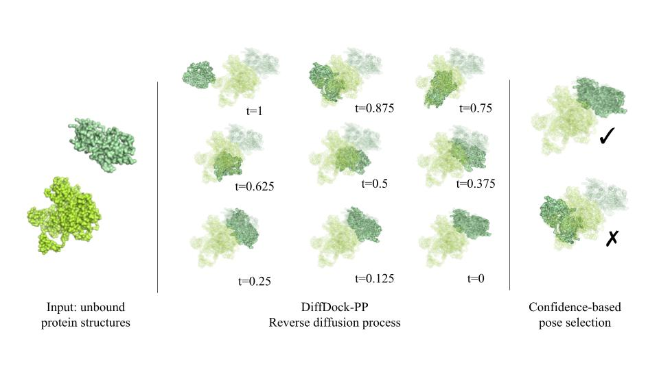

# DiffDock-PP
Implementation of [DiffDock-PP: Rigid Protein-Protein Docking with Diffusion Models](https://arxiv.org/abs/2304.03889) in PyTorch (ICLR 2023 - MLDD Workshop) by Mohamed Amine Ketata*, Cedrik Laue*, Ruslan Mammadov*, Hannes Stärk, Menghua Wu, Gabriele Corso, Céline Marquet, Regina Barzilay, Tommi S. Jakkola.

DiffDock-PP is a new approach to rigid-body protein-protein docking that is based on a diffusion generative model that learns to translate and rotate unbound protein structures into their bound conformations, and a confidence model that learns to rank different poses generated by the score model and select the best one. 

If you encounter any problem with the code, feel free to open an issue or contact mohamedamine.ketata@tum.de.



# Setup

### Installation

First, clone this repository
```
git clone https://github.com/ketatam/DiffDock-PP.git
```
Then, create a virtual environment to install the dependencies. We use `python=3.10.8`, but other new Python versions should work as well.
```
conda create -n diffdock_pp python=3.10.8
conda activate diffdock_pp
```

Now, you can install the required packages
```
conda install pytorch=1.13.0 pytorch-cuda=11.6 -c pytorch -c nvidia

# install compatible pytorch geometric in this order WITH versions
pip install --no-cache-dir  torch-scatter==2.0.9 torch-sparse==0.6.15 torch-cluster torch-spline-conv torch-geometric -f https://data.pyg.org/whl/torch-1.13.0+cu116.html

pip install numpy dill tqdm pyyaml pandas biopandas scikit-learn biopython e3nn wandb tensorboard tensorboardX matplotlib
```
Note that the code was tested on Ubuntu 22.04 using NVIDIA RTX A6000 GPUs.

### DIPS Data
To get the DIPS dataset, you can either follow the steps stated in the [EquiDock repo](https://github.com/octavian-ganea/equidock_public#dips-data) to download the raw data and process it to prepare the protein pairs for docking, or you can directly download the processed files (2.6GB):
```
curl -L -o datasets/DIPS/dips.zip https://www.dropbox.com/s/sqknqofy58nlosh/DIPS.zip?dl=0
unzip datasets/DIPS/dips.zip -d datasets/DIPS/pairs_pruned
```
This should result in creating the folder `datasets/DIPS/pairs_pruned` which contains around 962 folders corresponding to the different protein pairs present in DIPS.

The data split that we used can be found in `datasets/DIPS/data_file.csv`

### DB5.5 Data
We also support using the DB5.5 dataset, which can be downloaded from:
```
https://zlab.umassmed.edu/benchmark/
```
However, in this work we only focused on DIPS and therefore only release models that were trained on DIPS.

# Running DiffDock-PP
### Score Model Training
Our code supports multi-GPU training to accelerate the development of new models. To train a new score model from scratch, simply run
```
sh src/train.sh
```
In this bash file, you can specify the experimental setup such as the number and IDs of GPUs, batch size, etc. You also need to specify a config file that defines the parameters related to the data, model, training and inference. 

The parameters that we used to train our score model can be found in `config/dips_esm.yaml`. This file specifies, among other things, the path to the data folder, the model hyperparameters, the training and inference configuration.

Note that the very first run will take longer time as it processes the data and caches it for future runs.

### Confidence Model Training
As described in the paper, the confidence model is used to rank multiple poses generated by the score model based on predicted confidence scores. As such, it is a classification network that is trained to predict the quality of the poses generated by the score model. 

To train the confidence model, you first need to create its training dataset by generating multiple samples using the score model:
```
sh src/generate_samples.sh
```
Then, you can start the actual training by running
```
sh src/train_confidence.sh
```

### Trained Models
We provide the weights of our score model trained for 170 epochs on DIPS in `checkpoints/large_model_dips`

We also provide the weights of our trained confidence model in `checkpoints/confidence_model_dips`
### Inference
To run inference on the validation or test set, run
```
sh src/inference.sh
```
Similarly to training, you can specify all necessary configurations in the bash file and in the config files. The default configuration with the provided trained score and confidence models allows you to reproduce the numbers in the paper.

Note that if you want to test our models on your custom dataset, the easiest way would be to use the `DB5Loader` class defined in `src/data/data_train_utils.py` and name you PDB files `{PDB_ID}_l_b.pdb` and `{PDB_ID}_l_b.pdb` for the ligand and the receptor, respectively.

### Visualization
To visualize the predictions of the model, in the `inference.sh` script add the flag `--visualization_path path/to/visualization/folder` and it will save the protein complex structure at each time step of the reverse diffusion process as `.pdb` files that you can visualize using, e.g., [PyMOL](https://pymol.org/2/).

# Citation
```
@article{ketata2023diffdock,
  title={DiffDock-PP: Rigid Protein-Protein Docking with Diffusion Models},
  author={Ketata, Mohamed Amine and Laue, Cedrik and Mammadov, Ruslan and St{\"a}rk, Hannes and Wu, Menghua and Corso, Gabriele and Marquet, C{\'e}line and Barzilay, Regina and Jaakkola, Tommi S},
  journal={arXiv preprint arXiv:2304.03889},
  year={2023}
}
```
# Licence
MIT
